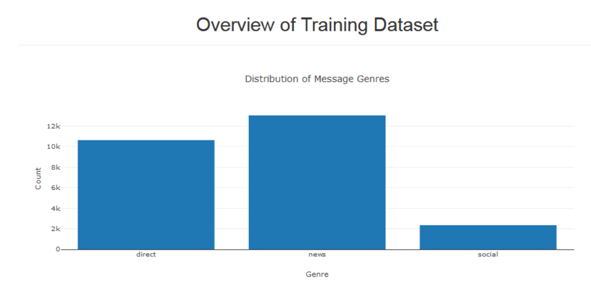

# Disaster-Response-Pipeline
This portfolio project's purpose is to apply data engineering to classify disaster response messages by machine learning. 

## Installation
I use python 3.5 to create this project and the main libraries I used are:

sikit-learn, 
nltk, 
Flask, 
gunicorn, 
numpy, 
pandas, 
plotly, 
sqlalchemy, 
jsonschema, 
punkt, 
wordnet, 
stopwords

## File Descriptions

### app
  run.py: flask file to run the web application
  
  templates: folder containing the html templates
### data
  DisasterResponse.db: created database from transformed and cleaned data.
  
  disaster_categories.csv: dataset including all the categories.
  
  disaster_messages.csv: dataset including all the messages.
  
  process_data.py: reads in the data, cleans and stores it in a SQL database.
### models
  train_classifier.py: created database from transformed and cleaned data.
  
## Results
frontpage of result

## Instructions
Run the following commands in the project's root directory to set up your database and model.

To run ETL pipeline that cleans data and stores in database python data/process_data.py data/disaster_messages.csv 

data/disaster_categories.csv data/DisasterResponse.db

To run ML pipeline that trains classifier and saves python models/train_classifier.py data/DisasterResponse.db models/classifier.pkl

Run the following command in the app's directory to run your web app. python run.py

Go to http://0.0.0.0:3001/
